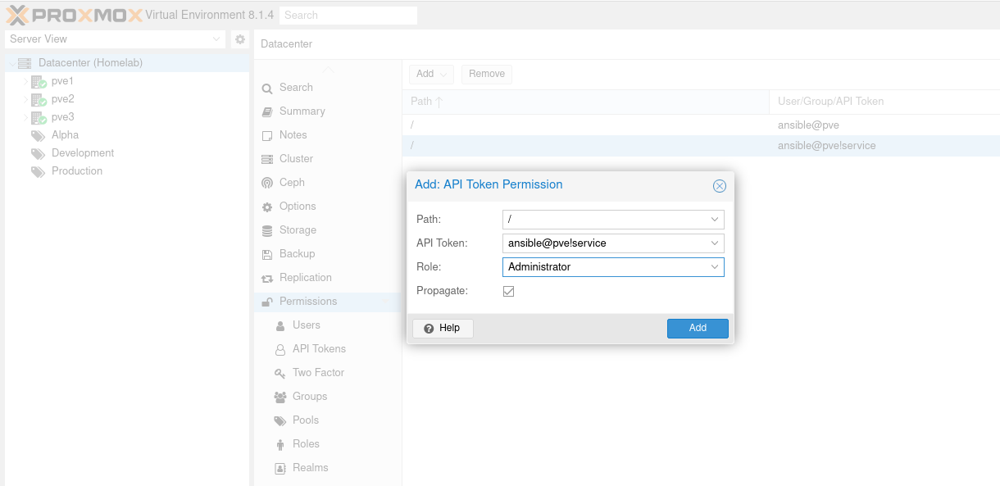

+++
title = 'Ansible Proxmox Inventory Plugin'
date = 2024-07-04T08:57:41-05:00
draft = true
summary = 'Dynamically building Ansible inventory from Proxmox.'
description = 'Dynamically building Ansible inventory from Proxmox.'
toc = false
readTime = true
autonumber = false
math = false
tags = ['ansible','proxmox']
showTags = true
hideBackToTop = false
+++

[Ansible](https://en.wikipedia.org/wiki/Ansible_(software)) is a configuration management tool for ensuring infrastructure consistency and maintaining an [IaC](https://en.wikipedia.org/wiki/Infrastructure_as_code) model.
Most tutorials describe managing a simple, static, inventory of hosts.
The problem is the lack of complex, real-world, dynamic inventory examples.
To address this for the [Proxmox](https://www.proxmox.com/en/) hypervisor we can use the [`community.general.proxmox`](https://docs.ansible.com/ansible/latest/collections/community/general/proxmox_inventory.html) inventory plugin to build an inventory of existing virtual machines.
The plugin provides features for filtering and categorizing hosts using a hybrid of plugin options and Ansible expressions.

This tutorial assumes administrative access to a Proxmox environment.
We will need to create a new user and API credential.

## Project Setup

To isolate our project environment we'll use a [virtual environment](https://docs.python.org/3/library/venv.html) to install all our dependencies.
For this example we need the main `ansible` application, [`ansible-vault`](https://docs.ansible.com/ansible/latest/cli/ansible-vault.html) for encrypting secrets, and [`ansible-lint`](https://ansible.readthedocs.io/projects/lint/) for validating the code.

```
~$ mkdir ansible-proxmox
~$ cd ansible-proxmox/
~/ansible-proxmox$ python -m venv .venv
~/ansible-proxmox$ . ./.venv/bin/activate
(.venv) ~/ansible-proxmox$ pip install ansible ansible-lint ansible-vault
```

Once the packages are installed we can confirm the current version with the following commands.
In this example I'm using ansible and ansible-vault 2.17.1 and ansible-lint 24.6.1.

```
(.venv) ~/ansible-proxmox$ ansible --version | head -n1
ansible [core 2.17.1]
(.venv) ~/ansible-proxmox$ ansible-vault --version | head -n1
ansible-vault [core 2.17.1]
(.venv) ~/ansible-proxmox$ ansible-lint --version
ansible-lint 24.6.1 using ansible-core:2.17.1 ansible-compat:24.6.1 ruamel-yaml:0.18.6 ruamel-yaml-clib:0.2.8
```

Next, create a new `ansible.cfg` configuration which will be used by default since it's in the root of our project.
The `-t all` forces all options to be generated and `--disabled` prefixes all generated options with a comment character to disable them.

```
(.venv) ~/ansible-proxmox$ ansible-config init -t all --disabled > ansible.cfg
```

## Inventory

Ansible inventory can be a simple `hosts` file or can be a collection of configurations in a directory.
We're going to use a directory to organize this project's inventory.
Create the inventory directory and tell Ansible to use it.

```
(.venv) ~/ansible-proxmox$ mkdir inventory
(.venv) ~/ansible-proxmox$ sed -i 's|^;inventory=.*$|inventory=./inventory|' ansible.cfg
```

We'll use a modified [example](https://docs.ansible.com/ansible/latest/collections/community/general/proxmox_inventory.html#examples) from the plugin documentation.
Create the dynamic inventory file `inventory/my.proxmox.yml` with the following content.
In the example, use your Proxmox server address in the `url` and `ansible_host` properties.

```yaml
plugin: community.general.proxmox
url: https://proxmox.mydomain.com:8006
validate_certs: false
want_facts: true

# Instead of login with password, proxmox supports api token authentication since release 6.2.
user: ansible@pve
token_id: service
token_secret: <<>>

# Group vms by tags for reference in playbooks.
keyed_groups:
  - key: proxmox_tags_parsed
    separator: ""
    prefix: tag_

#groups:
#  proxmox_managed_running: "'managed' in (proxmox_tags_parsed|list) and (proxmox_status == 'running')"
#  proxmox_use_agent: proxmox_agent == "1"
#  proxmox_usable: (proxmox_status == "running") and ('linux' in (proxmox_tags|split(';'))) and (( proxmox_vmtype == "lxc" ) or ( proxmox_vmtype == "qemu" and proxmox_agent == "1" ))
#  labservers: "'lab' in (proxmox_tags_parsed|list)"
#  webservers: "'web' in (proxmox_tags_parsed|list)"
#  mailservers: "'mail' in (proxmox_tags_parsed|list)"

compose:
  ansible_host: proxmox_name + ".mydomain.com"
#  ansible_host: proxmox_net0["ip"].split('/')[0] if 'ip' in proxmox_net0 else proxmox_agent_interfaces[1]["ip-addresses"][0].split('/')[0]
```

In my environment, the host name matches the VM name allowing me to leverage DNS instead of parsing the network interfaces for assigned IPs.
If your environment is configured differently, you'll need to adjust the `ansible_host` property accordingly.

I'm using a separate administrative account named `ansible` that is registered to the Proxmox server itself, instead of using [PAM](https://en.wikipedia.org/wiki/Linux_PAM). 
The authentication mechanism is an API token associated to the user account.

## Proxmox Authentication

Create the `ansible` user under the _Datacenter &#8594; Permissions &#8594; Users_ section.
The **Realm** must be set to _Proxmox VE authentication_.


API tokens are a [stateless authentication](https://pve.proxmox.com/wiki/User_Management#pveum_tokens) mechanism with greater flexibility to restrict scope and set separate expiration times.
Tokens are managed under _Datacenter &#8594; Permissions &#8594; API Tokens_.
Upon creation, the API token password, called a token secret, is generated and displayed just once.
This value will be later encrypted using `ansible-vault` and stored directly in the inventory file.


Lastly, permissions need to be associated to both the new `ansible` user and API.
For simplicity, I can use the existing `Administrator` role which grants all permissions, but this could be restricted by creating a dedicated role.

Under _Datacenter &#8594; Permissions_ create a new "User Permission" and "API Token Permission" for the `ansible` user and API respectively.



N.B. A token secret is unrecoverable and can only be removed and recreated; but, doing this automatically removes all associated Roles to the token.

## Password Encryption with ansible-vault

To store the token secret in Git it must be first encrypted.
Ansible Vault provides a mechanism to embed encrypted values in Ansible.
To encrypt the token secret first generate a password file that `ansible-vault` will use.

```
(.venv) ~/ansible-proxmox$ tr -dc A-Za-z0-9_ < /dev/urandom | head -c 16 > .vault_password
```

Then, using the token secret from the previous step, generate an encrypted password for the inventory file.

```
(.venv) ~/ansible-proxmox$ ansible-vault encrypt_string --vault-password .vault_password '4d18fa1d-00fb-4d42-ae3e-1282cade0155' --name 'token_secret'
Encryption successful
token_secret: !vault |
          $ANSIBLE_VAULT;1.1;AES256
          64343233393336343166663935353233643633653264303636303731613732623062323133313862
          6164346461313337623837616464383339313436316462370a306163643230393436393835646236
          66373035366639356634643732616335613064356535613039643866376335656235633737316266
          3761313931663836380a656165303930376539333962376136653637396264663732396465306466
          38333235323161366639333738336265333161633431616132366630356330663237643935333038
          3633393030313263616137333631343561316231626430646238
```

Use this value in the `my.proxmox.yml` inventory file in place of 

```
token_secret: <<>>
```

### Custom Ansible User with Dynamic Inventory

If the VM hosts require a custom ansible user it can be specified using a separate inventory file to define a variable on the `proxmox_all_qemu` group that will be merged into the dynamic inventory that's generated.
Create a file `inventory/proxmox.yml` with the following:

```yaml
proxmox_all_qemu:
  vars:
    ansible_user: ubuntu
```

## Using the Dynamic Inventory

The inventory generated above automatically groups VMs and containers by tag prefixed with `tag_`.

In addition to the default `all` and `ungrouped` groups the following groups and generated.

* `proxmox_all_lxc` - all containers across all nodes in the cluster
* `proxmox_all_qemu` - all virtual machines across all nodes in the cluster
* `proxmox_all_running` - only running hosts
* `proxmox_all_stopped` - all stopped hosts
* `proxmox_nodes` - list of all nodes in the Proxmox cluster

All pools generate a separate group with the format:

* `proxmox_pool_*`

For each cluster node, all VMs and containers on that node are grouped by:

* `proxmox_*_lxc`
* `proxmox_*_qemu`

